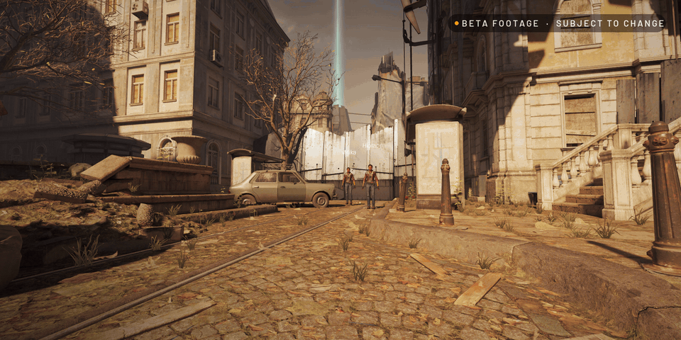

  

# Alyx Multiplayer

Play Half-Life: Alyx with your friends. One of you hosts, the others join, and you play through the story
together. Works with a VR headset, or with mouse and keyboard thanks to [HLA NoVR](https://github.com/HLANoVR/HLA-NoVR).

**[Download the latest version](https://github.com/Requiem-Software/AlyxMP/releases/latest)** (Windows, free)

## Install

1. Run `AlyxMP-Setup.exe`. If Windows warns you, click **More info → Run anyway**.
2. Want to play without VR? Leave **Install HLA NoVR** ticked.
3. Click **Install**, then **Play**. Next time, open *Alyx Multiplayer* from the Start menu.

Everyone needs the same version of Alyx MP. SteamVR has to be installed, even without a headset.

## Play together

- **Host:** type your name, click **Start hosting** and send your friends the address it shows.
- **Join:** type your name, paste the host's address and click **Join**.

The game starts on its own and puts you right next to the host. If your friends can't connect, the host
needs to open TCP port 27420 on their router, or you can all use a VPN like Tailscale.

## In the game

- **Y** to chat, **ESC** for settings.
- A dot in your crosshair means you can use what you're looking at.
- Carrying something? Hold the **right mouse button** and move the mouse to turn it. **E** drops it.
- You see each other as Alyx, with your names above your heads.
- Doors, puzzles, items, enemies and story moments are shared, so you're always in the same world.
- To move on to the next level, everyone has to stand in the loading zone at the exit.
- If you die, you come back next to the host. If something looks out of sync, click **Resync my world**.
- The game saves every 5 minutes and after every level change.

## Good to know

- Enemies are run by the host's game: everyone sees them in the same place, going after the same player,
  with the same health, and they die for everyone at once.
- Alyx MP adds a few small things to NoVR: a new HUD, auto reload and one line in its
  interaction script. Uninstalling removes them.
- The launcher tells you when there's a new version: click **Update** at the top, or tick
  **Update automatically** under *update log*.
- To uninstall, run `AlyxMP-Setup.exe` again and click **Uninstall**. Your saves stay where they are.

## Build it yourself

Install the .NET SDK, run `build.ps1`, and the installer lands in `dist/`.

---

Fan-made and not affiliated with Valve. HLA NoVR is made by the NoVR team (GPL-3.0).
